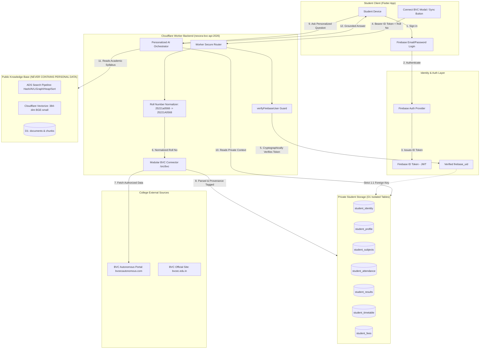
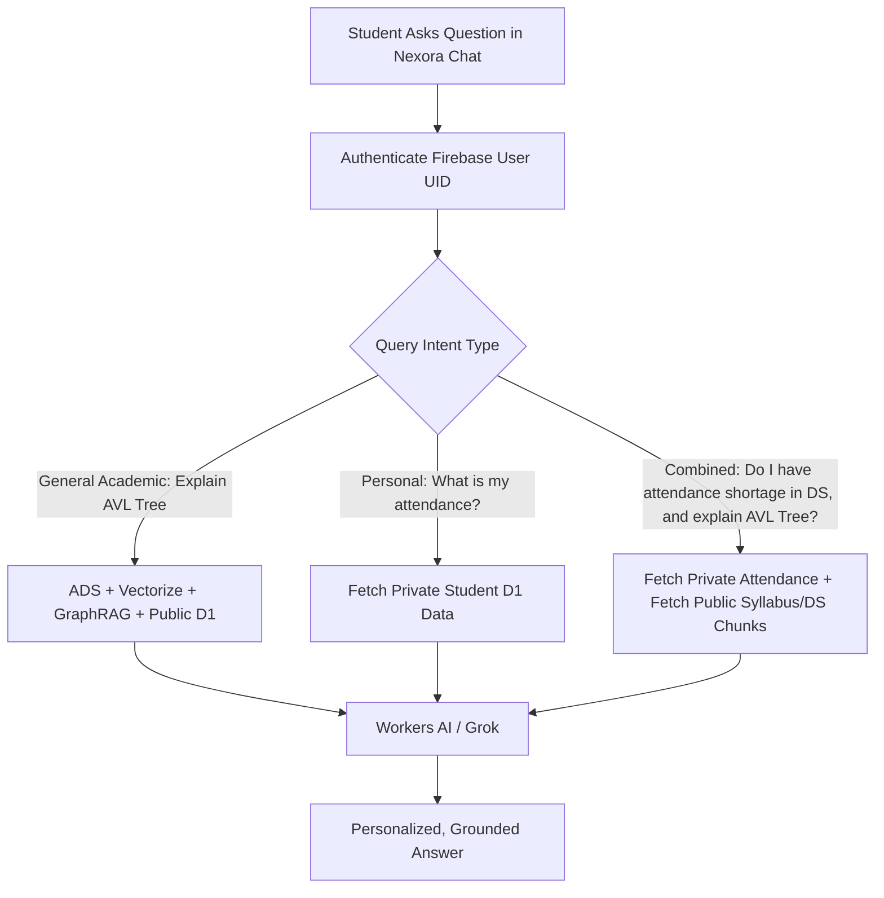

# Nexora — BVC Personal Data Architecture & Privacy Engine

**Component:** Private Student Identity & Academic Profile Subsystem  
**Integration Target:** BVC Engineering College Autonomous Portal (`bvcecautonomous.com`)  
**Security Model:** Strict Isolation, Zero Cross-Student Leakage, Invariant Firebase Auth  

---

## 1. Architectural Overview & Separation

Nexora maintains a **strict two-tier data boundary**. General academic knowledge (syllabus, notes, regulations, lecture transcripts) is stored in the public RAG engine. Personal academic data (attendance, grades, marks, timetable, fee dues) is strictly confined to authenticated, private student storage.



---

## 2. Invariant Authentication Contract

1. **Existing Auth Untouched:** The existing Firebase Email/Password authentication in [`AuthService`](file:///c:/Users/Admin/Desktop/final%20nexora/nexora/lib/features/authentication/data/auth_service.dart) remains 100% untouched.
2. **Identity Linkage:**
   $$\text{Firebase UID} \xrightarrow{\text{1 : 1 Link}} \text{BVC Normalized Roll Number} \xrightarrow{\text{Private Context}} \text{Student Profile Records}$$
3. **No Frontend Trust:** The backend extracts the `firebase_uid` directly from the verified Firebase JWT payload. The frontend cannot claim to be another user by passing an arbitrary UID or roll number.

---

## 3. Proposed Private D1 Database Schema

To ensure total isolation from public study chunks, the following private tables will be provisioned in Cloudflare D1:

```sql
-- 1. Student Identity & BVC Linkage Table
CREATE TABLE IF NOT EXISTS student_identity (
    firebase_uid TEXT PRIMARY KEY,
    bvc_roll_number TEXT UNIQUE NOT NULL,
    verification_status TEXT DEFAULT 'PENDING', -- PENDING, VERIFIED, EXPIRED, FAILED
    last_synced_at TIMESTAMP,
    created_at TIMESTAMP DEFAULT CURRENT_TIMESTAMP,
    updated_at TIMESTAMP DEFAULT CURRENT_TIMESTAMP
);
CREATE INDEX IF NOT EXISTS idx_student_identity_roll ON student_identity(bvc_roll_number);

-- 2. Student Academic Profile Table
CREATE TABLE IF NOT EXISTS student_profile (
    firebase_uid TEXT PRIMARY KEY,
    full_name TEXT,
    roll_number TEXT NOT NULL,
    course TEXT,           -- e.g. B.Tech
    branch TEXT,           -- e.g. Computer Science and Engineering
    department TEXT,       -- e.g. CSE
    year INTEGER,          -- 1, 2, 3, 4
    semester INTEGER,      -- 1, 2
    section TEXT,          -- A, B, C
    regulation TEXT,       -- BR23, BR20, BR18
    academic_batch TEXT,   -- 2022-2026
    college_email TEXT,
    data_source TEXT DEFAULT 'BVC_PORTAL',
    verified INTEGER DEFAULT 1,
    synced_at TIMESTAMP DEFAULT CURRENT_TIMESTAMP,
    FOREIGN KEY(firebase_uid) REFERENCES student_identity(firebase_uid) ON DELETE CASCADE
);

-- 3. Student Current Enrolled Subjects
CREATE TABLE IF NOT EXISTS student_subjects (
    id INTEGER PRIMARY KEY AUTOINCREMENT,
    firebase_uid TEXT NOT NULL,
    subject_code TEXT NOT NULL,
    subject_name TEXT NOT NULL,
    credits REAL,
    faculty_name TEXT,
    semester INTEGER,
    academic_year TEXT,
    data_source TEXT DEFAULT 'BVC_PORTAL',
    synced_at TIMESTAMP DEFAULT CURRENT_TIMESTAMP,
    FOREIGN KEY(firebase_uid) REFERENCES student_identity(firebase_uid) ON DELETE CASCADE,
    UNIQUE(firebase_uid, subject_code, semester)
);
CREATE INDEX IF NOT EXISTS idx_student_subjects_uid ON student_subjects(firebase_uid);

-- 4. Student Attendance Records
CREATE TABLE IF NOT EXISTS student_attendance (
    id INTEGER PRIMARY KEY AUTOINCREMENT,
    firebase_uid TEXT NOT NULL,
    subject_code TEXT NOT NULL,
    subject_name TEXT NOT NULL,
    classes_conducted INTEGER DEFAULT 0,
    classes_attended INTEGER DEFAULT 0,
    percentage REAL DEFAULT 0.0,
    status TEXT, -- e.g. 'Satisfactory', 'Shortage Warning', 'Condonation'
    data_source TEXT DEFAULT 'BVC_PORTAL',
    synced_at TIMESTAMP DEFAULT CURRENT_TIMESTAMP,
    FOREIGN KEY(firebase_uid) REFERENCES student_identity(firebase_uid) ON DELETE CASCADE,
    UNIQUE(firebase_uid, subject_code)
);
CREATE INDEX IF NOT EXISTS idx_student_attendance_uid ON student_attendance(firebase_uid);

-- 5. Student Examination Results & Marks
CREATE TABLE IF NOT EXISTS student_results (
    id INTEGER PRIMARY KEY AUTOINCREMENT,
    firebase_uid TEXT NOT NULL,
    semester INTEGER NOT NULL,
    subject_code TEXT NOT NULL,
    subject_name TEXT NOT NULL,
    internal_marks REAL,
    external_marks REAL,
    total_marks REAL,
    grade TEXT,
    grade_points REAL,
    credits REAL,
    result_status TEXT, -- PASS, FAIL, WITHHELD
    sgpa REAL,
    cgpa REAL,
    data_source TEXT DEFAULT 'BVC_PORTAL',
    synced_at TIMESTAMP DEFAULT CURRENT_TIMESTAMP,
    FOREIGN KEY(firebase_uid) REFERENCES student_identity(firebase_uid) ON DELETE CASCADE,
    UNIQUE(firebase_uid, semester, subject_code)
);
CREATE INDEX IF NOT EXISTS idx_student_results_uid ON student_results(firebase_uid);

-- 6. Student Weekly Class Timetable
CREATE TABLE IF NOT EXISTS student_timetable (
    id INTEGER PRIMARY KEY AUTOINCREMENT,
    firebase_uid TEXT NOT NULL,
    day_of_week TEXT NOT NULL, -- Monday, Tuesday, etc.
    period_number INTEGER NOT NULL,
    time_slot TEXT,            -- e.g. 09:30 AM - 10:20 AM
    subject_code TEXT NOT NULL,
    subject_name TEXT NOT NULL,
    faculty_name TEXT,
    room_number TEXT,
    data_source TEXT DEFAULT 'BVC_PORTAL',
    synced_at TIMESTAMP DEFAULT CURRENT_TIMESTAMP,
    FOREIGN KEY(firebase_uid) REFERENCES student_identity(firebase_uid) ON DELETE CASCADE
);
CREATE INDEX IF NOT EXISTS idx_student_timetable_uid ON student_timetable(firebase_uid);

-- 7. Student Fee Dues & Payment Status
CREATE TABLE IF NOT EXISTS student_fees (
    id INTEGER PRIMARY KEY AUTOINCREMENT,
    firebase_uid TEXT NOT NULL,
    fee_type TEXT NOT NULL,     -- Tuition, Exam, Bus, Hostel
    amount_due REAL DEFAULT 0.0,
    amount_paid REAL DEFAULT 0.0,
    due_date TEXT,
    payment_status TEXT,        -- PAID, PENDING, OVERDUE
    receipt_reference TEXT,
    data_source TEXT DEFAULT 'BVC_PORTAL',
    synced_at TIMESTAMP DEFAULT CURRENT_TIMESTAMP,
    FOREIGN KEY(firebase_uid) REFERENCES student_identity(firebase_uid) ON DELETE CASCADE
);
CREATE INDEX IF NOT EXISTS idx_student_fees_uid ON student_fees(firebase_uid);
```

---

## 4. Field Normalization & Provenance Layer

Every field extracted from BVC contains clear metadata provenance:
```json
{
  "field": "branch",
  "value": "Computer Science and Engineering",
  "normalized": "CSE",
  "source": "BVC_PORTAL",
  "verified": true,
  "syncedAt": "2026-09-04T10:30:00Z"
}
```

### Canonical Mapping Dictionary
- **Branch Normalizer:**
  - `"Computer Science & Engineering"`, `"Computer Science and Engineering"`, `"CSE"` $\rightarrow$ `"CSE"`
  - `"Artificial Intelligence & Machine Learning"`, `"CSE(AI&ML)"`, `"AIML"` $\rightarrow$ `"AI&ML"`
  - `"Electronics & Communication"`, `"ECE"` $\rightarrow$ `"ECE"`
  - `"Information Technology"`, `"IT"` $\rightarrow$ `"IT"`
- **Semester Normalizer:**
  - `"I"`, `"1"`, `"First"`, `"SEM-1"` $\rightarrow$ `1`
  - `"II"`, `"2"`, `"Second"`, `"SEM-2"` $\rightarrow$ `2`
- **Regulation Normalizer:**
  - `"BR-23"`, `"BVC R23"`, `"BR23"` $\rightarrow$ `"BR23"`
  - `"BR-20"`, `"BR20"` $\rightarrow$ `"BR20"`

---

## 5. Secure Student API Specification

All student endpoints require `Authorization: Bearer <Firebase_ID_Token>`:

| Endpoint | Method | Purpose | Response Payload |
| :--- | :--- | :--- | :--- |
| `/student/connect` | `POST` | Links BVC Roll Number to Firebase UID | `{ success: true, rollNumber: "25221A0568", status: "VERIFIED" }` |
| `/student/sync` | `POST` | Triggers live synchronization with BVC | `{ success: true, lastSyncedAt: "...", modules: ["profile", "attendance", "results"] }` |
| `/student/me` | `GET` | Complete unified student profile + summary | `{ identity, profile, attendanceSummary, cgpa, currentSem }` |
| `/student/profile` | `GET` | Personal academic metadata & branch/section | `{ name, rollNumber, branch, year, semester, section, regulation }` |
| `/student/attendance` | `GET` | Subject-wise and cumulative attendance | `{ overallPercentage: 84.5, subjects: [...] }` |
| `/student/results` | `GET` | Semester grade sheets & SGPA/CGPA | `{ cgpa: 8.42, semesters: [...] }` |
| `/student/timetable` | `GET` | Weekly timetable periods and rooms | `{ today: [...], schedule: {...} }` |
| `/student/fees` | `GET` | Fee statuses and due circulars | `{ feeRecords: [...], totalDue: 0 }` |

---

## 6. Personalized AI Query Router

When a student asks Nexora a question, the AI Controller determines whether the question is **General Academic**, **Personal Student**, or **Combined**:



---

## 7. Failure Handling & Non-Destructive Sync Guarantee

- **SBCMS Offline / Maintenance:** Nexora returns the last successfully cached academic profile with clear status: `"BVC portal is temporarily unreachable. Displaying your records from [lastSyncedAt]."`.
- **Zero-Overwrite Rule:** If a sync attempt fails halfway, existing verified attendance or results are **never** cleared or replaced with empty records.
- **Credential Safety:** At no point are student passwords stored in D1, embedded in prompts, or passed to LLMs.

---

*Document approved for Nexora Engineering.*
